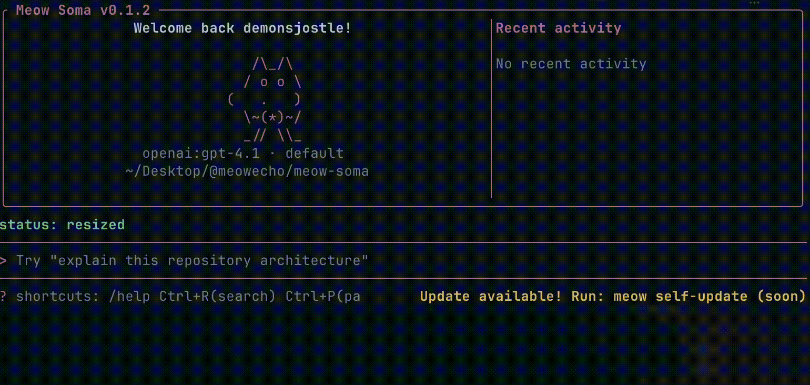

# Meow Soma

**Pronunciation:** /ˈso.ma/ (Greek) · /ˈsoʊmə/ (English)  
*(soh-ma / soh-muh)*

<p align="center">
  
</p>

---

## Meow Soma – The Body of Intelligence
**Enter the body. Command the mind.**

Meow Soma is an AI-native terminal environment designed to unify intelligence, execution, and collaboration inside a single command.

It is not just a CLI tool.  
It is the embodied runtime where AI reasoning meets action.

## Vision

Modern AI tools are fragmented:

- One tool for chat
- Another for code
- Another for automation
- Another for agents

Meow Soma brings them into one coherent body.

It is designed as:

- A unified AI CLI
- A context-aware multi-repository environment
- An extensible agent runtime
- A foundation for future AI-native workflows

Where other tools assist, Meow Soma inhabits.

## Philosophy

Every intelligence needs a body.

The model is the mind.  
The runtime is the body.  
The terminal is the gateway.

Meow Soma is the body of intelligence  
where thought becomes execution.

If intelligence is the mind,  
Meow Soma is the body.

## Why Meow Soma

- **One runtime, one command**: chat, run goals, call tools, inspect sessions, and expose MCP from a single CLI.
- **Action with guardrails**: risky operations are policy-gated with explicit approval paths.
- **Persistent by default**: sessions, messages, and telemetry are stored locally for continuity and auditability.
- **Provider-flexible**: supports OpenAI, Anthropic, and Ollama.
- **Terminal-first UX**: full-screen TUI with streaming output, command palette, history search, and inline approvals.

## What You Can Do Today

- Ask one-shot questions: `meow ask "..."`
- Execute higher-level goals: `meow run "..."`
- List and execute tools with policy checks: `meow tool list|exec`
- Run MCP server over stdio: `meow mcp serve --transport stdio`
- Inspect, resume, export, and import sessions: `meow session ...`
- Inspect/export runtime telemetry: `meow metrics summary|export`

## Quickstart

### Install from source

```bash
cargo build --release
install -m 0755 target/release/meow /usr/local/bin/meow
meow --help
```

### Configure a provider

OpenAI:

```bash
meow config setup --provider openai
export OPENAI_API_KEY=<your_openai_key>
meow config validate
meow ask "health check"
```

Anthropic:

```bash
meow config setup --provider anthropic
export ANTHROPIC_API_KEY=<your_anthropic_key>
meow config validate
meow ask "health check"
```

Ollama:

```bash
meow config setup --provider ollama
ollama serve
meow config validate
meow ask "health check"
```

### Local dev config (no `~/.meow-soma` state)

```bash
cargo run -- --config config/dev.local.toml config validate
cargo run -- --config config/dev.local.toml ask "hello"
```

## Command Surface

- `meow` (default: start full-screen TUI)
- `meow ask "<prompt>"`
- `meow run "<goal>"`
- `meow tool list`
- `meow tool exec <tool> ... [--approve]`
- `meow mcp serve --transport stdio`
- `meow session list|resume|export|import`
- `meow config init|setup|validate|path`
- `meow metrics summary [--days N]`
- `meow metrics export [--days N] [-o metrics.json]`

## TUI Essentials

- Start TUI: `meow` (or `cargo run -- --config config/dev.local.toml`)
- Send: `Enter`
- Exit: `Esc`, `Ctrl+C`, `/quit`
- Slash commands:
  - `/help`, `/home`, `/init [--force]`, `/memory [status|show|paths|reload]`, `/clear`, `/session`, `/provider`, `/profile <name>`, `/new [title]`, `/tool [name ...]`, `/status`, `/palette`, `/quit`
  - Aliases include `/commands`, `/model`, `/tools`, `/mem`, `/bootstrap`, `/exit`, `/q`
- History: `Up` / `Down`
- History search: `Ctrl+R`
- Command palette: `Ctrl+P`
- Scroll transcript: `PgUp` / `PgDn`, `Home`, `End`
- Clear input/transcript: `Ctrl+U` / `Ctrl+L`
- Inline approval for risky `/tool` actions: `y/yes` or `n/no`

## Instruction Memory

- Effective prompt instructions are loaded with deterministic precedence: `user < local < project`.
- Default memory file locations:
  - User scope: `~/.meow-soma/memory/instructions.md` (or `storage.memory_dir/instructions.md`)
  - Local scope: `<project-root>/.meow-soma/instructions.local.md`
  - Project scope: `<project-root>/.meow-soma/instructions.md`
- Use `/init` to create the project file and `/memory reload` to pick up file edits without restarting TUI.

## Safety Model

- Runtime config path: `~/.meow-soma/config.toml`
- Tool execution is governed by a permission gate (`allow/ask/deny` behavior).
- `fs.write` is restricted to workspace boundaries by default.
- Optional extra write roots via `MEOW_FS_WRITE_ALLOW_ROOTS`.

## MCP Interop

- Transport: stdio (`meow mcp serve --transport stdio`)
- Protocol version: `meow.mcp.v1`
- Core methods: `ping`, `server/info`, `tools/list`, `tools/call`
- Stable error codes include:
  - `invalid_json`, `invalid_request`, `unsupported_version`, `unknown_method`, `unknown_tool`, `approval_required`, `policy_denied`, `tool_execution_error`

## Docs Map

- Install guide: `docs/INSTALL.md`
- Config guide: `docs/CONFIG.md`
- Testing guide: `docs/TESTING.md`
- Provider troubleshooting: `docs/PROVIDER_TROUBLESHOOTING.md`
- Release process: `docs/RELEASE_PROCESS.md`
- Execution plan: `docs/plans/execution-plan.md`
- Backlog: `docs/plans/backlog.md`
- Roadmap: `docs/plans/roadmap.md`
- Changelog: `CHANGELOG.md`
- Collaboration rules: `AGENTS.md`

## Status

- Current release track: `v0.1.x`
- Active implementation phases and priorities are maintained in `docs/plans/execution-plan.md` and `docs/plans/backlog.md`.
